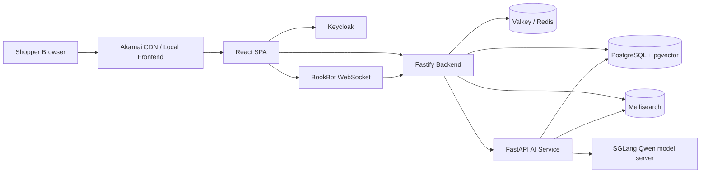
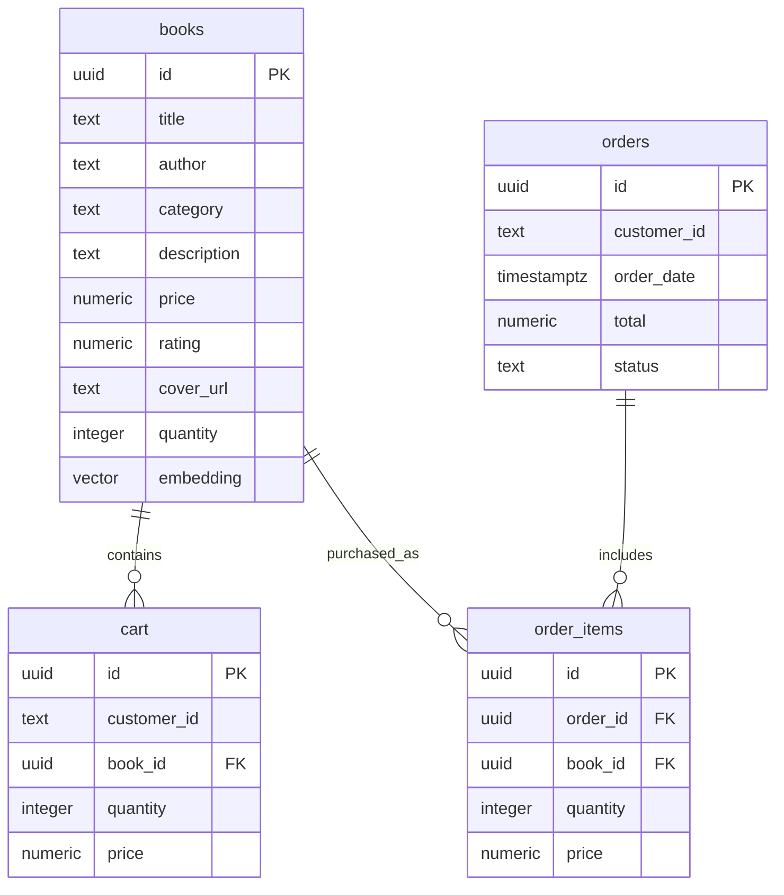

# Akamai Bookstore Project Documentation

## Overview

Akamai Bookstore is a full-stack ecommerce demo built around a React storefront, Fastify API, FastAPI AI service, PostgreSQL with pgvector, Valkey/Redis, Meilisearch, and Keycloak. It demonstrates how a bookstore workload commonly associated with AWS managed services can run on Akamai Connected Cloud using portable open-source infrastructure.

## Repository Layout

```text
akamai-bookstore/
  frontend/       React 18, TypeScript, Vite, Tailwind, Zustand
  backend/        Fastify 4, TypeScript, PostgreSQL, Redis, Meilisearch, Keycloak JWT
  ai-service/     FastAPI, OpenAI-compatible SGLang client, sentence-transformers, pgvector, Meilisearch
  scripts/        Database initialization, seed data, embeddings, search indexing
  k8s/            Kubernetes deployment entry points
  docker-compose.yml
  .env.example
```

## Runtime Architecture



## Services

### Frontend

- Path: `akamai-bookstore/frontend`
- Framework: React 18 with TypeScript and Vite.
- Styling: Tailwind CSS.
- State: Zustand stores for auth, cart, and assistant state.
- Routing: React Router routes for home, browse, book detail, search, cart, checkout, and orders.
- Auth: Keycloak JS client.
- Assistant: Floating BookBot component connects to backend WebSocket.

### Backend API

- Path: `akamai-bookstore/backend`
- Framework: Fastify 4 with TypeScript.
- Plugins: CORS, Helmet, rate limit, WebSocket, PostgreSQL, Redis, Meilisearch, auth.
- Validation: Zod schemas in route handlers.
- Auth: JWT verification against Keycloak JWKS.
- Health: `/health` checks PostgreSQL and Redis.

### AI Service

- Path: `akamai-bookstore/ai-service`
- Framework: FastAPI.
- Startup: loads sentence-transformers model, opens PostgreSQL pool, initializes Meilisearch client.
- Chat: `/chat/stream` returns SSE chunks; `/chat` returns complete response.
- Retrieval: embeds the user query, retrieves vector results from PostgreSQL, retrieves keyword results from Meilisearch, merges with reciprocal rank fusion, and sends context to SGLang.

### Data Stores

- PostgreSQL stores books, cart items, orders, order items, and embeddings.
- pgvector powers similarity search for recommendations and AI retrieval.
- Valkey/Redis stores bestseller ranking in a sorted set named `bestsellers`.
- Meilisearch powers full-text catalog search.
- Keycloak provides auth realm and clients.

## Primary User Flows

### Browse And Search

1. User lands on home page.
2. Home loads bestsellers and featured books.
3. User navigates to browse or search.
4. Frontend calls `/api/books`, `/api/bestsellers`, or `/api/search`.
5. Backend reads PostgreSQL, Redis, or Meilisearch and returns book summaries.

### Cart And Checkout

1. User signs in through Keycloak.
2. User adds items to cart.
3. Frontend calls protected cart endpoints with JWT.
4. User checks out.
5. Backend reads cart, creates order and order item records, increments Redis bestseller scores, and clears cart.
6. User can view order history through `/api/orders`.

### Recommendations

1. Authenticated user requests personalized recommendations.
2. Backend checks prior purchased books.
3. If purchase history exists, backend finds vector-similar books while excluding purchased IDs.
4. If no purchase history exists, backend returns highest-rated books.

### BookBot

1. User opens floating BookBot.
2. Frontend opens WebSocket to `/api/assistant?token=...`.
3. Backend validates JWT via Keycloak JWKS.
4. Backend forwards message to AI service `/chat/stream`.
5. AI service retrieves book context from pgvector and Meilisearch.
6. SGLang response tokens stream back through backend WebSocket to the frontend.

## API Summary

| Method | Path | Auth | Purpose |
| --- | --- | --- | --- |
| GET | `/health` | No | Backend health check |
| GET | `/api/books` | No | Paginated catalog |
| GET | `/api/books/:id` | No | Book detail |
| GET | `/api/bestsellers` | No | Redis-backed bestseller list |
| GET | `/api/search` | No | Meilisearch-backed search |
| GET | `/api/cart` | Yes | Retrieve cart |
| POST | `/api/cart` | Yes | Add cart item |
| PUT | `/api/cart` | Yes | Update cart quantity |
| DELETE | `/api/cart/:bookId` | Yes | Remove cart item |
| POST | `/api/cart/merge` | Yes | Merge guest cart payload |
| GET | `/api/orders` | Yes | Order history |
| POST | `/api/orders` | Yes | Checkout |
| GET | `/api/recommendations` | Yes | Personalized recommendations |
| GET | `/api/recommendations/:bookId` | No | Similar books |
| WS | `/api/assistant?token=` | Yes | Streaming BookBot |
| POST | `/api/assistant/chat` | Yes | Non-streaming BookBot fallback |

## Local Development

1. Copy `.env.example` to `.env`.
2. Configure `LLM_BASE_URL`, `LLM_API_KEY`, and `LLM_MODEL` if SGLang is not running at the defaults.
3. Start infrastructure with Docker Compose.
4. Seed PostgreSQL with `scripts/seed.ts`.
5. Generate embeddings with `scripts/generate-embeddings.py`.
6. Index Meilisearch with `scripts/index-meilisearch.ts`.
7. Seed Redis bestsellers with `scripts/seed-redis-leaderboard.ts`.
8. Start the full Compose stack.

## Data Model



## Review Notes

- The app is coherent and has a clean service split for a cloud migration demo.
- The README describes a broader production posture than the code currently proves through tests or manifests. Treat it as target architecture plus local working stack.
- Guest cart merge exists in the API but the scanned frontend cart flow requires sign-in.
- Checkout is intentionally simplified and does not include payment, inventory deduction, or stock conflict handling.
- BookBot token-in-query design is acceptable for a controlled demo but should be revised for hardened production deployment.
